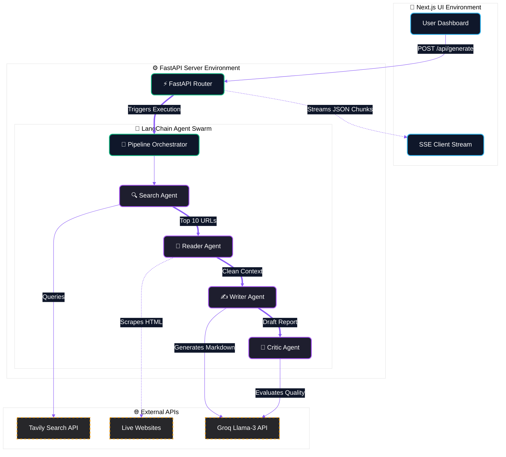
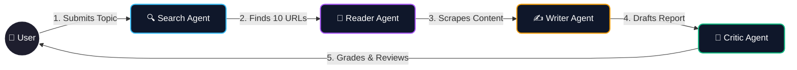

# NEXUS (Multi AI Research Agent)

NEXUS is a powerful, LangChain-based full-stack AI research pipeline. It orchestrates a sequence of intelligent AI agents to autonomously explore topics, scrape raw content, synthesize comprehensive markdown documents, and critique quality reviews.

---

## 🏗️ Architecture Diagram
Below is the high-level architecture of how the NEXUS frontend and backend interact:



---

## 🤖 Agent Workflow



---

## ✨ Features
- **Multi-Agent Orchestration**: Specialized LangChain agents working autonomously in sequence.
- **Real-Time Streaming**: Server-Sent Events (SSE) stream the pipeline progress live to the UI.
- **Review & Compare Modes**: Upload your own `.docx` drafts to bypass the search phase and have the Critic Agent review or compare reports locally.
- **Stunning UI**: A dark-mode, glassmorphic Next.js interface with Framer Motion micro-animations and an interactive "Orbital Sphere".
- **Instant Report Generation**: Compiles the final LLM output into styled, in-memory Word (`.docx`) files for immediate download.

---

## 💻 Tech Stack
**Frontend:**
- Next.js 16 (App Router)
- React 19 & TypeScript
- Tailwind CSS (v4)
- Framer Motion (Animations)
- Lucide React (Icons)

**Backend:**
- Python 3.10+
- FastAPI & Uvicorn
- LangChain
- BeautifulSoup (Web Scraping)
- API Integrations: Groq (Llama 3), Tavily (Search)

---

## 📂 Folder Structure
The project is built as a clean, decoupled monorepo:

```text
MRLA/
├── backend/
│   ├── main.py              # FastAPI server, API routes, SSE endpoints
│   ├── pipeline.py          # Core workflow logic connecting the agents
│   ├── agent.py             # LangChain prompts and agent configurations
│   ├── tools.py             # Tavily search and BeautifulSoup scrapers
│   ├── requirements.txt     # Python dependencies
│   └── .env                 # API Keys (Groq, Tavily)
│
└── frontend/
    ├── package.json         # Node.js dependencies
    ├── src/
    │   ├── app/
    │   │   ├── globals.css  # Dark-mode UI variables
    │   │   ├── layout.tsx   # Root Next.js layout
    │   │   └── page.tsx     # Unified dashboard application
    │   ├── components/      # UI components (OrbitalSphere, ReportViewer, etc.)
    │   └── hooks/
    │       └── useSSE.ts    # React hook for FastAPI streaming
```

---

## 🚀 Future Improvements
- **Google Scholar Integration**: Adding an academic search tool to the Search Agent to prioritize peer-reviewed papers.
- **Streaming Markdown Writing**: Updating the Writer Agent to stream its markdown output character-by-character to the frontend instead of waiting for the full response.
- **PDF Export**: Adding an option to export the generated literature review as a perfectly formatted PDF directly from the browser.
- **Custom Agent Prompts**: Adding a settings menu allowing users to tweak the "persona" of the Critic Agent.

---


