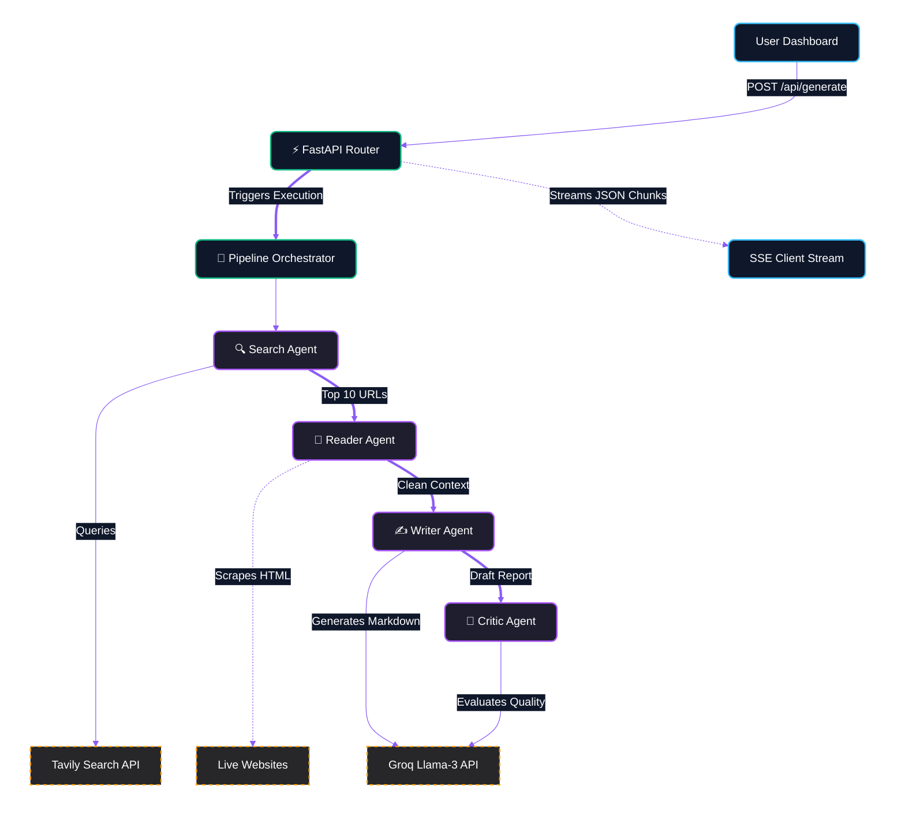
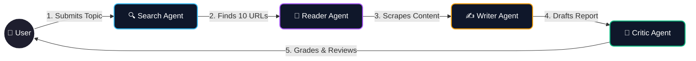
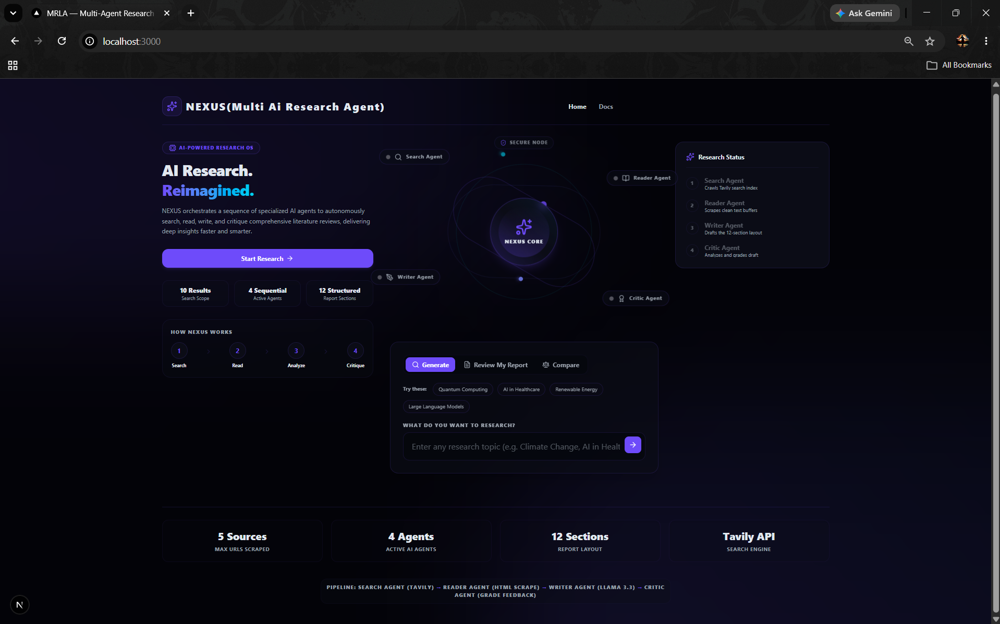
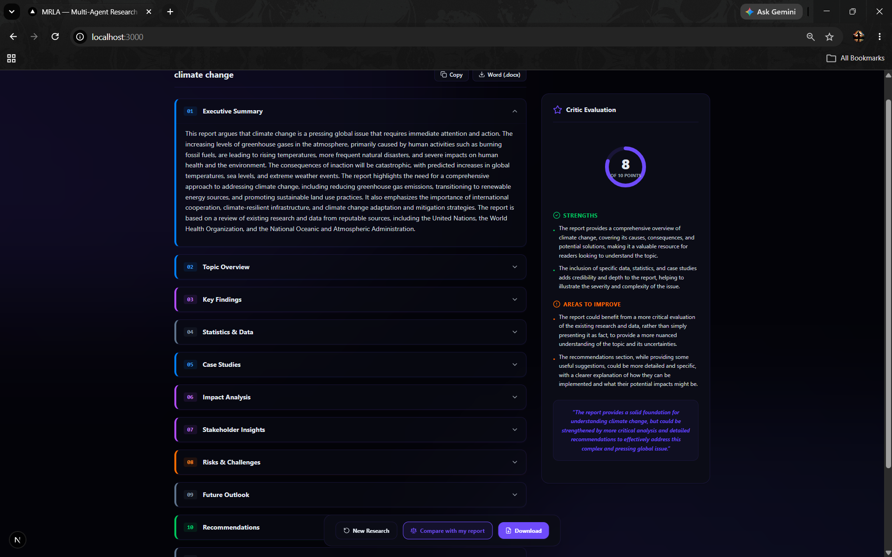
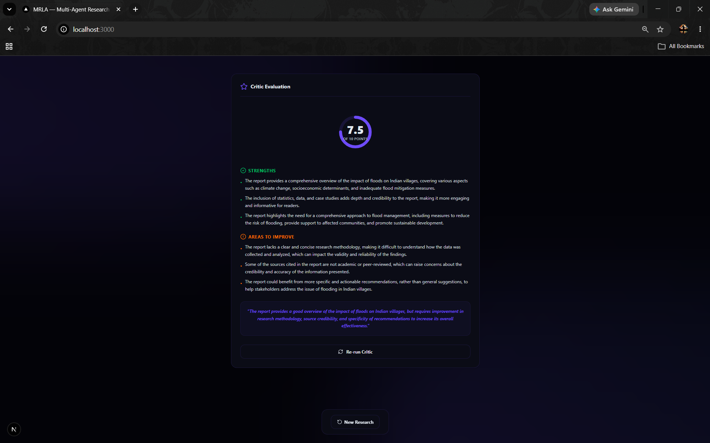
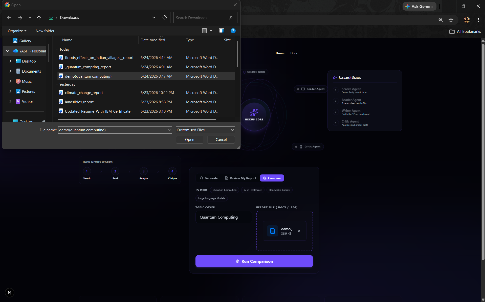
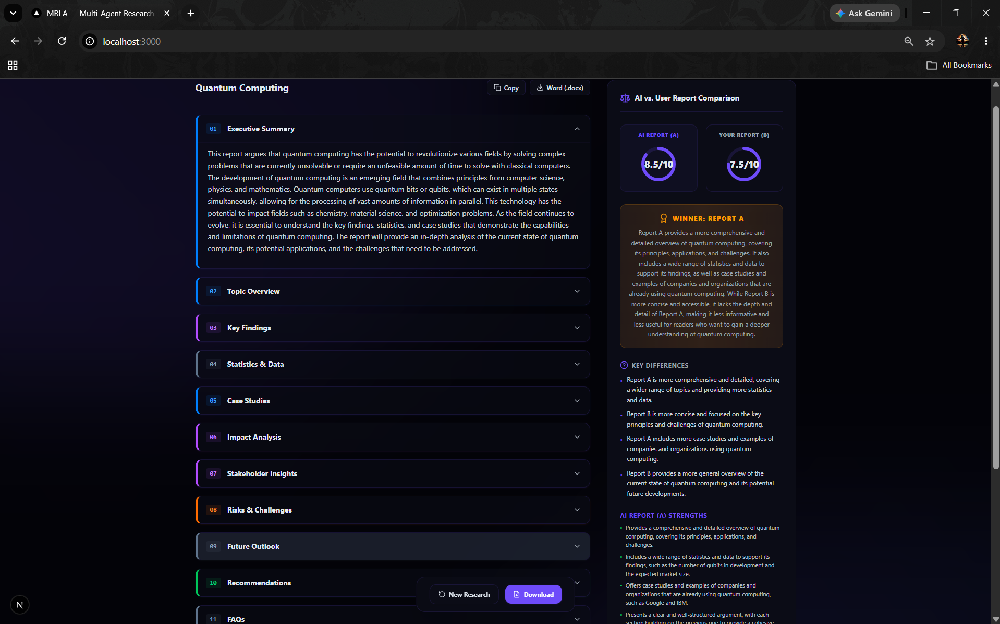

# NEXUS (Multi AI Research Agent)

[](https://opensource.org/licenses/MIT)

**NEXUS** is an autonomous, full-stack AI research assistant. Imagine having a team of specialized researchers working for you around the clock. You simply give NEXUS a topic, and it deploys a swarm of AI agents to scour the live internet, read articles, extract facts, and synthesize everything into a beautifully structured, comprehensive literature review. It then uniquely grades its own work to ensure the highest quality output—saving you hours of manual research and writing.

---

## 🏗️ Architecture Diagram
Below is the high-level architecture of how the NEXUS frontend and backend interact:



---

## 🤖 Agent Workflow



---

## ✨ Features
- **Multi-Agent Orchestration**: Specialized LangChain agents working autonomously in sequence.
- **Real-Time Streaming**: Server-Sent Events (SSE) stream the pipeline progress live to the UI.
- **Review & Compare Modes**: Upload your own `.docx` or `.pdf` drafts to bypass the search phase and have the Critic Agent review or compare reports locally.
- **Stunning UI**: A dark-mode, glassmorphic Next.js interface with Framer Motion micro-animations and an interactive "Orbital Sphere".
- **Instant Report Generation**: Compiles the final LLM output into styled, in-memory Word (`.docx`) files for immediate download.

---

## 📸 Live Demo & Screenshots

### Live Video Demo
Watch NEXUS autonomously research, synthesize, and critique a topic in real-time.

<video src="assets/DEMO.mp4" controls width="100%"></video>

<br/>
### 1. Research Dashboard
The central hub for NEXUS. This sleek, dark-mode interface features a dynamic "Orbital Sphere" that animates as background agents perform their tasks. You can quickly select between Generate, Review, or Compare modes to start your workflow.



### 2. Live Report Generation
Once a topic is provided, the multi-agent swarm scours the web and generates a beautifully formatted 12-section literature review right before your eyes.



### 3. Critic's Review Mode
Bypass the generation phase by uploading your own `.docx` or `.pdf` file. The Critic Agent strictly analyzes your writing, assigns a score out of 10, highlights strengths, and provides actionable feedback to improve your draft.



### 4. Comparison Setup
Prepare to compare two reports side-by-side. Simply provide a research topic for NEXUS to generate a pristine AI report, and upload your own draft on the same topic for comparison.



### 5. Final Comparison & Grading
The ultimate showdown. The Critic Agent compares your uploaded report against the AI-generated report, judging both on structure, credibility, and depth. It declares a winner, outlines key differences, and lets you download the winning report instantly!



---

## 💻 Tech Stack
**Frontend:**
- Next.js 16 (App Router)
- React 19 & TypeScript
- Tailwind CSS (v4)
- Framer Motion (Animations)
- Lucide React (Icons)

**Backend:**
- Python 3.10+
- FastAPI & Uvicorn
- LangChain
- BeautifulSoup (Web Scraping)
- API Integrations: Groq (Llama 3), Tavily (Search)

---

## 📂 Folder Structure
The project is built as a clean, decoupled monorepo:

```text
MRLA/
├── backend/
│   ├── main.py              # FastAPI server, API routes, SSE endpoints
│   ├── pipeline.py          # Core workflow logic connecting the agents
│   ├── agent.py             # LangChain prompts and agent configurations
│   ├── tools.py             # Tavily search and BeautifulSoup scrapers
│   ├── requirements.txt     # Python dependencies
│   └── .env                 # API Keys (Groq, Tavily)
│
└── frontend/
    ├── package.json         # Node.js dependencies
    ├── src/
    │   ├── app/
    │   │   ├── globals.css  # Dark-mode UI variables
    │   │   ├── layout.tsx   # Root Next.js layout
    │   │   └── page.tsx     # Unified dashboard application
    │   ├── components/      # UI components (OrbitalSphere, ReportViewer, etc.)
    │   └── hooks/
    │       └── useSSE.ts    # React hook for FastAPI streaming
```

---

## 🚀 Future Improvements
- **Google Scholar Integration**: Adding an academic search tool to the Search Agent to prioritize peer-reviewed papers.
- **Streaming Markdown Writing**: Updating the Writer Agent to stream its markdown output character-by-character to the frontend instead of waiting for the full response.
- **PDF Export**: Adding an option to export the generated literature review as a perfectly formatted PDF directly from the browser.
- **Custom Agent Prompts**: Adding a settings menu allowing users to tweak the "persona" of the Critic Agent.

---

## ⚡ How to Run

NEXUS is built as a split full-stack application. The easiest way to run it is by using **VS Code's Split Terminal**.

### Step 1: Start the Backend (Terminal 1)
1. Open the root `MRLA` folder in VS Code.
2. Open a new terminal and navigate to the backend:
   ```bash
   cd backend
   ```
3. Activate your virtual environment and start the Python server:
   ```bash
   ..\.venv\Scripts\activate
   python -m uvicorn main:app --host 127.0.0.1 --port 8000
   ```
   *(Wait for `Uvicorn running on http://127.0.0.1:8000`)*

### Step 2: Start the Frontend (Terminal 2)
1. Split your terminal (`Ctrl + Shift + 5`) to open a second pane.
2. Navigate to the frontend folder and start the Next.js app:
   ```bash
   cd frontend
   npm run dev
   ```
   *(Wait for `Local: http://localhost:3000`)*

### Step 3: Begin Researching!
Hold **`Ctrl`** and click `http://localhost:3000` in your terminal to open the NEXUS dashboard in your browser.
